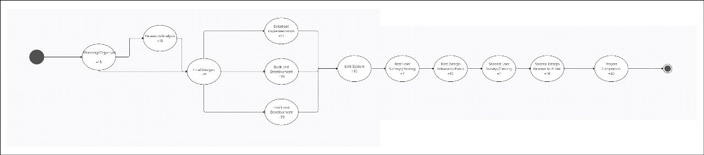
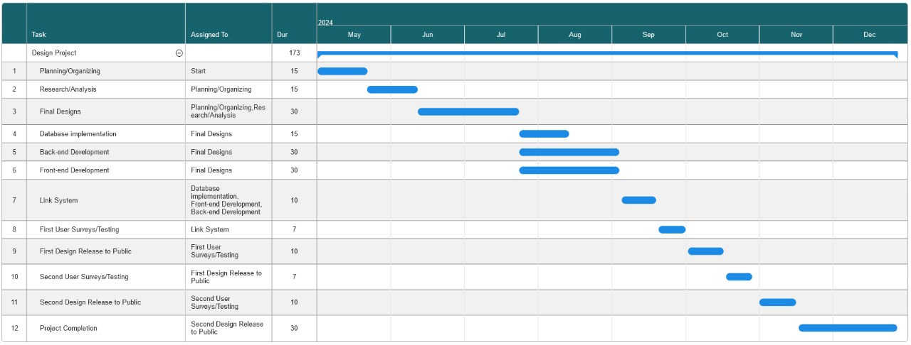
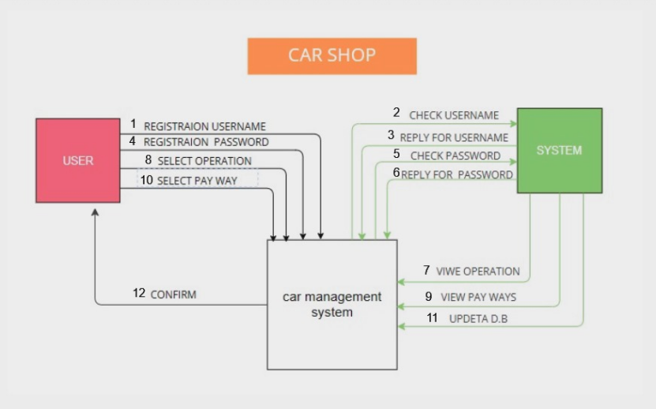
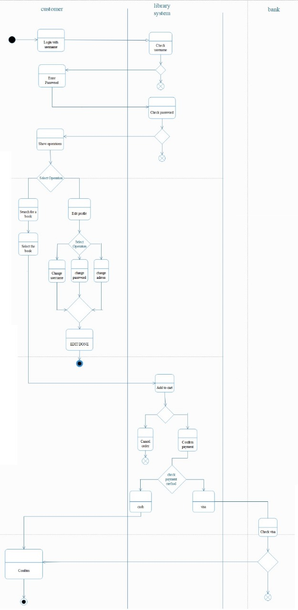
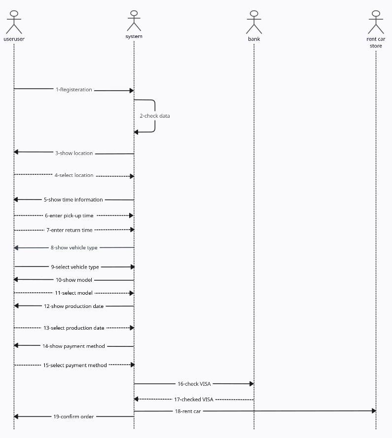
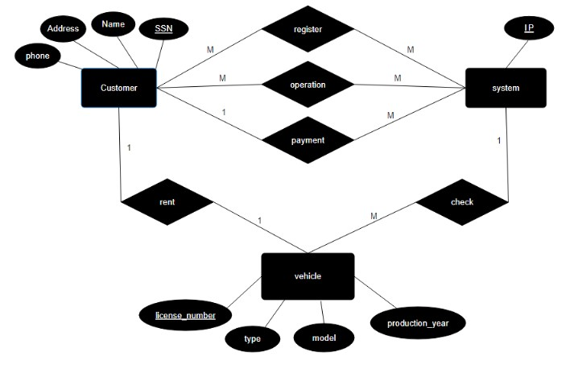

<!-- # Design-analisys-project-implemintation -->
# Rent Car Project implemintation

## UI/UX

## Pert diagram

## Gante diagram

## DFD

## State diagram

## Function diagram

## Context diagram

## Activity diagram

## Sequence diagram

## Class diagram

## ERD diagram

## Schema diagram

## Usecase diagram

